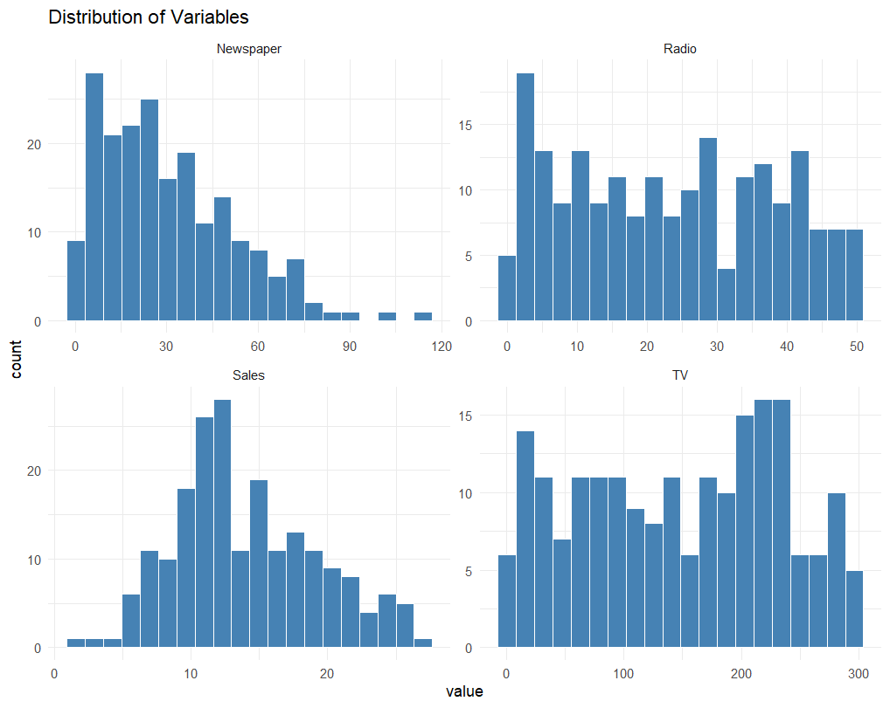
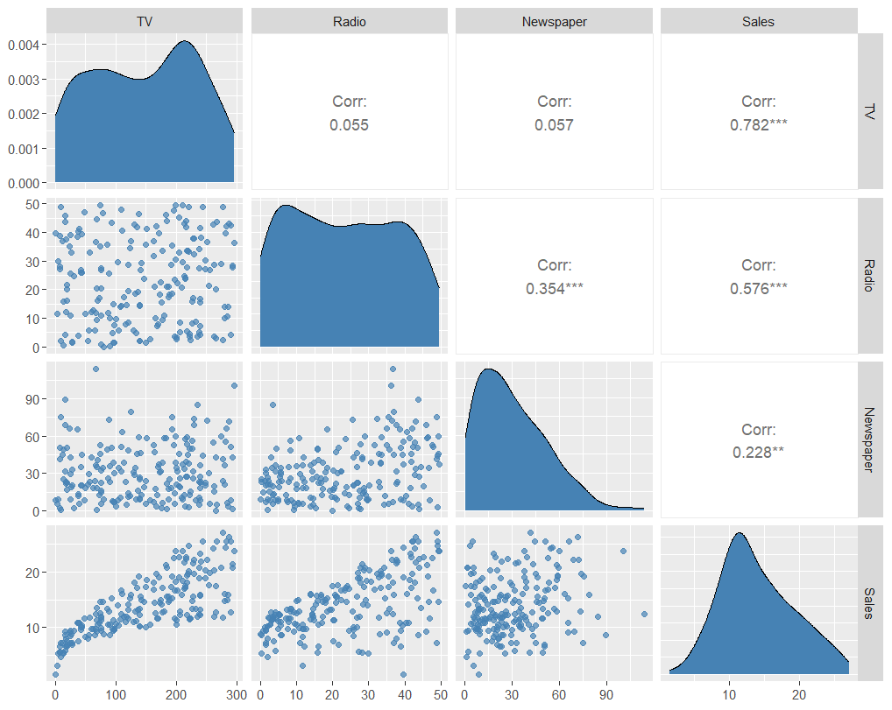
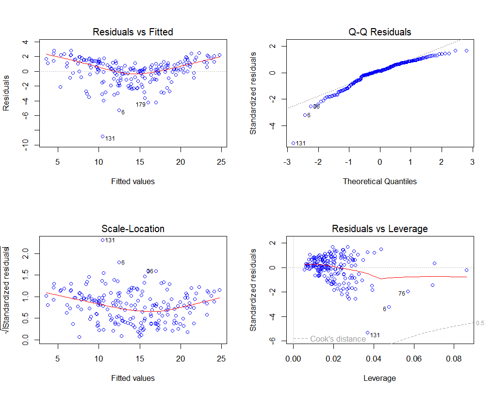
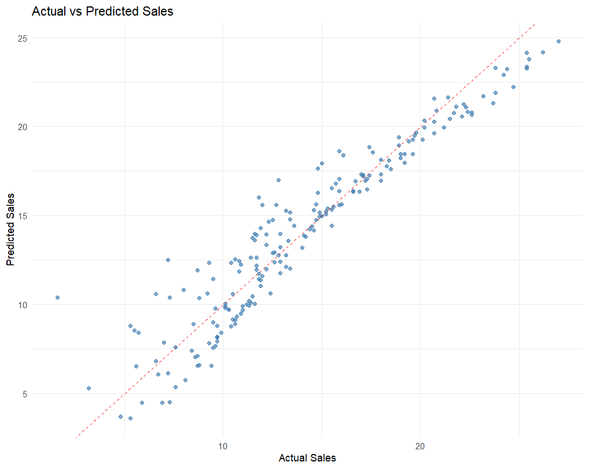

# 📈 Advertising Sales Analysis in R

A statistical data analysis and sales prediction project implemented in **R**.

The project investigates the relationship between advertising expenditures and product sales using exploratory data analysis, multiple linear regression, diagnostic testing, and model evaluation.

---

# Project Overview

This project demonstrates a complete statistical modeling workflow:

- Exploratory Data Analysis (EDA)
- Correlation Analysis
- Multiple Linear Regression
- Feature Selection
- Model Diagnostics
- Sales Prediction
- Model Evaluation

The objective is to identify which advertising channels have the strongest impact on sales and build an interpretable regression model.

---

# Technologies

- R
- tidyverse
- GGally
- MASS
- caret
- car

---

# Project Structure

```
advertising-sales-analysis-r/

│
├── advertising_code.R
├── README.md
│
├── data/
│   └── Advertising.csv
│
└── figures/
    ├── distribution_of_variables.png
    ├── ggpairs.png
    ├── sales_vs_radio_advertising.png
    ├── actual_vs_predicted_sales.png
    ├── cooks_distance.png
    └── four_plots.png
```

---

# Dataset

The dataset contains advertising budgets allocated across three media channels:

- TV
- Radio
- Newspaper

Target variable:

- Sales

---

# Exploratory Data Analysis

The project includes:

- Variable distributions
- Pairwise relationships
- Correlation analysis
- Scatter plots
- Summary statistics

### Distribution of Variables



### Pairwise Relationships



---

# Regression Analysis

Two regression models were developed:

- Full Model (TV + Radio + Newspaper)
- Reduced Model (TV + Radio)

The models were compared using:

- Adjusted R²
- Partial F-Test
- AIC Stepwise Selection

---

# Model Diagnostics

The regression assumptions were evaluated using:

- Residual plots
- Q-Q Plot
- Scale-Location Plot
- Residuals vs Leverage
- Cook's Distance
- Variance Inflation Factor (VIF)

### Regression Diagnostics



### Cook's Distance


---

# Prediction Performance

The final model was evaluated using:

- RMSE
- R² Score

### Actual vs Predicted Sales



---

# Statistical Methods

The project applies:

- Multiple Linear Regression
- Feature Selection
- Model Comparison
- Residual Analysis
- Multicollinearity Detection
- Confidence Intervals
- Prediction Analysis

---

# Running the Project

Open the R script:

```
advertising_code.R
```

Install the required packages:

```R
install.packages(c(
  "tidyverse",
  "GGally",
  "car",
  "MASS",
  "caret"
))
```

Run the script in RStudio.

---

# Future Improvements

Possible extensions include:

- Cross-validation
- Regularized Regression (Lasso/Ridge)
- Elastic Net
- Interactive Dashboard using Shiny
- Machine Learning Regression Models

---

# Author

**Myrzabek Sagynzhan**

Data Science Student

---

# Disclaimer

This project was created for educational and portfolio purposes.
